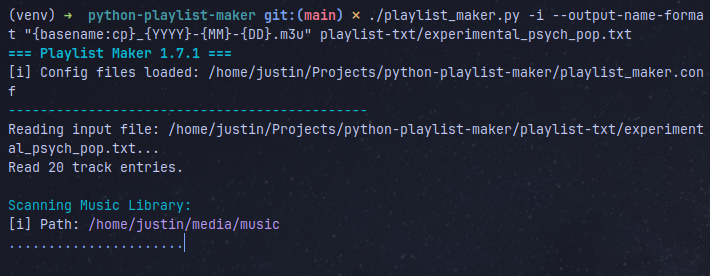
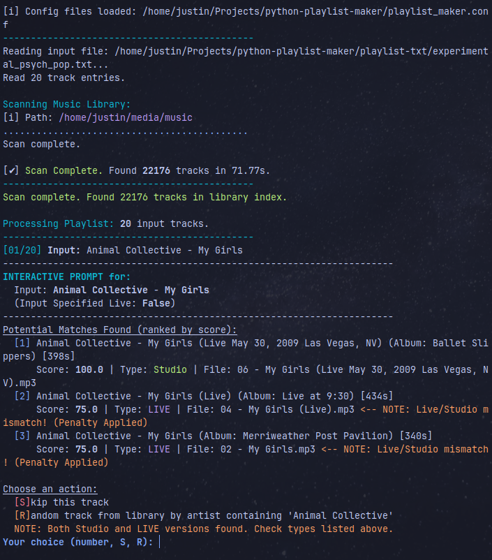
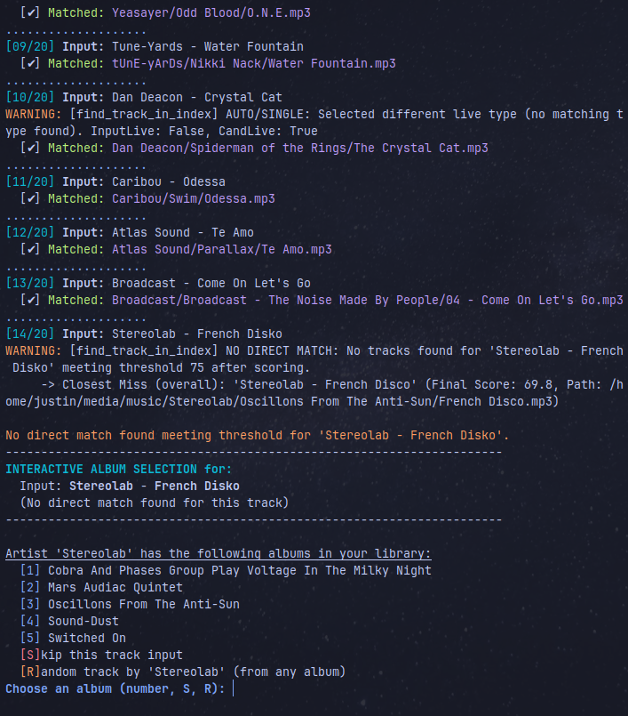
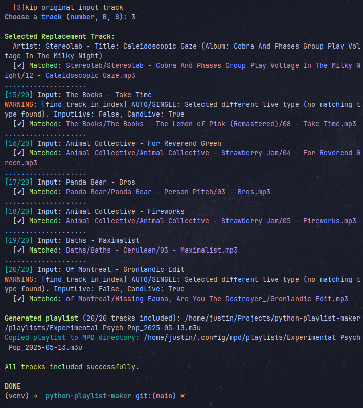

# Playlist Maker (.m3u)

This Python script converts simple text files containing `Artist - Track` listings into `.m3u` playlists suitable for anything that uses the standard .m3u playlist format. It intelligently matches the tracks against your local music library using fuzzy string matching and metadata analysis.

## Concept

"I want to easily create playlists using music from my own music library." With this method, you can easily concept the playlist in text files and run them through `playlist_maker.py` to generate .m3u playlists. Making playlists by hand is fun, but using AI to help generate them, curate them, and then quickly convert them to .m3u playlists using this script is what I've come up with so far. 

The ultimate version is to somehow feed AI a database of my library, query it with playlist params, have it return the query with a playlist in the format that this script expects, and trigger this script to output the .m3u. I've gotten to the point where I've successfully used AI to trigger this script with an `Artist - Track` formatted playlist, but since it doesn't know what music I have, it is hit or miss with resulting playlists. That being said, with this script I can spend a little more time curating AI generated playlists to fit the music I own in my music library. 

## Overview

The script scans your specified music library, builds an index of your tracks (including metadata like artist, title, album, duration, and identifying live recordings), and then processes an input text file. For each `Artist - Track` line in the input file, it searches the library index for the best match. It generates an M3U playlist file with relative paths based on your music directory configuration, making it directly usable by any android music app or software that uses .m3u format playlists. It also features an interactive mode for resolving ambiguities and allows customizable output filenames.

Here's an example of the script scanning the library:



When an ambiguous match occurs in interactive mode, you'll see a prompt like this:



Here is another example of the interactive mode showing a prompt for a track selection:



And finally, when the playlist is ready:




## Features

- **Text List Input:** Reads simple `.txt` files with one `Artist - Track` per line.
- **Library Scanning:** Scans your music library directory for supported audio files (`.mp3`, `.flac`, `.ogg`, `.m4a` by default).
- **Metadata Extraction:** Uses `mutagen` to read artist, title, album, and duration tags.
- **Fuzzy Matching:** Uses `fuzzywuzzy` to find matches even with slight variations in names or typos.
- **Smart Normalization:** Cleans up artist/track names before matching (handles case, accents, `&`/`/`/`and`, featuring artists like `(feat. ...)` , strips common parenthetical terms like `(remix)`, removes track numbers).
- **Live Track Handling:**
    - Detects live tracks based on `(live)` in title/filename or keywords in album titles (e.g., "Live at", "Unplugged").
    - Applies a configurable score penalty when matching a non-live input track to a live library track.
    - Prioritizes live/studio tracks based on whether the input track specified `(live)`.
- **Customizable Output Filenames:** Allows users to define a format string for the generated M3U playlist filename using placeholders for basename, date/time components, and transformations (e.g., capitalization, separator changes).
- **MPD Compatibility:** Generates M3U playlists with paths relative to your configured MPD music directory.
- **Interactive Mode (`-i`):** Prompts the user to resolve ambiguities when:
    - Multiple good matches are found.
    - No match meets the threshold.
    - Offers choices like selecting a specific match, skipping the track, or picking a random track by the same artist.
- **Missing Tracks Report:** Creates a separate text file listing tracks from the input that couldn't be matched or were skipped.
- **Configurable:** Many options controllable via configuration files (`playlist_maker.conf`, `~/.config/playlist-maker/config.ini`) and command-line arguments.
- **Logging:** Detailed logging to a file (`warning.log` by default) for troubleshooting.

## Prerequisites

- **Python:** Version 3.7 or higher recommended.
- **Pip:** Python's package installer (usually comes with Python).
- **Python Libraries:**
    - `mutagen`
    - `fuzzywuzzy`
    - `python-levenshtein` (Recommended for `fuzzywuzzy` performance)
    - `pandas` (Optional, for enhanced duration checks; script has a fallback)

## Installation

1.  **Clone or Download:** Get the `playlist_maker.py` script and save it to your desired project directory.
2.  **Python Environment Setup:** Follow the "Detailed Python Environment Setup Walkthrough" below to install Python (if needed) and set up a virtual environment.
3.  **Create `requirements.txt`:** In your project directory, create a file named `requirements.txt` with the following content:

    ```txt
    mutagen
    fuzzywuzzy
    python-levenshtein
    # pandas # Optional: uncomment if you want to install pandas
    ```

4.  **Install Dependencies:** Activate your virtual environment and run:
    ```bash
    pip install -r requirements.txt
    ```

---

### Detailed Python Environment Setup Walkthrough

1.  **Check for Python Installation:**

    - Open your terminal/command prompt.
    - Type `python --version` (or `python3 --version`) and press Enter.
    - If you see `Python 3.x.y` (where x >= 7), you're good.
    - If not, or if you see Python 2, you need to install/upgrade Python 3.

2.  **Install Python 3 (If Needed):**

    - **Windows:** Download from [python.org/downloads/windows/](https://www.python.org/downloads/windows/). **Crucially, check "Add Python 3.x to PATH"** during installation.
    - **macOS:** Download from [python.org/downloads/macos/](https://www.python.org/downloads/macos/) or use Homebrew (`brew install python3`).
    - **Linux (Debian/Ubuntu):** `sudo apt update && sudo apt install python3 python3-pip python3-venv`
    - **Linux (Fedora/CentOS):** `sudo dnf install python3 python3-pip`
    - Verify with `python3 --version` in a _new_ terminal window.

3.  **Ensure Pip is Up-to-Date:**

    ```bash
    python3 -m pip install --upgrade pip
    ```

4.  **Navigate to Your Project Directory:**

    ```bash
    cd path/to/your/playlist-maker-folder
    ```

5.  **Create a Virtual Environment:**
    (The `requirements.txt` file should already be created in this directory from Step 3 of the main Installation section.)

    ```bash
    python3 -m venv venv
    ```

    This creates an isolated `venv` folder for project dependencies.

6.  **Activate the Virtual Environment:**

    - **Windows (Command Prompt):** `venv\Scripts\activate.bat`
    - **Windows (PowerShell):** `venv\Scripts\Activate.ps1` (You might need to adjust script execution policy: `Set-ExecutionPolicy -ExecutionPolicy RemoteSigned -Scope Process`)
    - **macOS / Linux (bash/zsh):** `source venv/bin/activate`
    - Your terminal prompt should now indicate the active environment (e.g., `(venv)`).

7.  **Install Requirements (If not done in main installation steps):**
    While the virtual environment is active:

    ```bash
    pip install -r requirements.txt
    ```

8.  **Running the Script:**
    With the virtual environment active:

    ```bash
    python playlist_maker.py your_input_file.txt [other options...]
    ```

9.  **Deactivate (When Done):**
    ```bash
    deactivate
    ```

---

## Usage

The script is run from the command line. Here's a basic example and the help output:

**Basic Invocation:**

```bash
python playlist_maker.py input_playlist.txt
python playlist_maker.py -i --output-name-format "{basename:cp}_{YYYY}-{MM}-{DD}.m3u" your_playlist_name.txt
```

**Help Output:**

```bash
python playlist_maker.py --help

usage:  playlist_maker.py [-h] [-l LIBRARY] [--mpd-music-dir MPD_MUSIC_DIR]
                          [-o OUTPUT_DIR] [--missing-dir MISSING_DIR]
                          [-m [MPD_PLAYLIST_DIR]] [-t [0-100]]
                          [--live-penalty [0.0-1.0]]
                          [--output-name-format OUTPUT_NAME_FORMAT]
                          [--log-file LOG_FILE]
                          [--log-mode {append,overwrite}]
                          [--log-level {DEBUG,INFO,WARNING,ERROR}]
                          [-e EXTENSIONS [EXTENSIONS ...]]
                          [--live-album-keywords LIVE_ALBUM_KEYWORDS [LIVE_ALBUM_KEYWORDS ...]]
                          [--strip-keywords STRIP_KEYWORDS [STRIP_KEYWORDS ...]]
                          [-i]
                          input_playlist_file.txt

Generate M3U playlists by matching 'Artist - Track' lines against a music
library.

positional arguments:
    playlist_file         Input text file (one 'Artist - Track' per line).

options:
    -h, --help            show this help message and exit
    -l LIBRARY, --library LIBRARY
                        Music library path. Cfg: Paths.library, Def: ~/music
    --mpd-music-dir MPD_MUSIC_DIR
                        MPD music_directory path. Cfg: Paths.mpd_music_dir,
                        Def: ~/music
    -o OUTPUT_DIR, --output-dir OUTPUT_DIR
                        Output dir for M3U. Cfg: Paths.output_dir, Def:
                        ./playlists
    --missing-dir MISSING_DIR
                        Dir for missing tracks list. Cfg: Paths.missing_dir,
                        Def: ./missing-tracks
    -m [MPD_PLAYLIST_DIR], --mpd-playlist-dir [MPD_PLAYLIST_DIR]
                        Copy M3U to MPD dir. No value=use default/config. Cfg:
                        Paths.mpd_playlist_dir
    -t [0-100], --threshold [0-100]
                        Min match score [0-100]. Cfg: Matching.threshold, Def:
                        75
    --live-penalty [0.0-1.0]
                        Penalty for unwanted live match. Cfg:
                        Matching.live_penalty, Def: 0.75
    --output-name-format OUTPUT_NAME_FORMAT
                        Custom format string for the output M3U filename.
                        Placeholders: {basename}, {basename:transforms},
                        {YYYY}, {YY}, {MM}, {DD}, {hh}, {mm}, {ss}.
                        Transforms for basename (e.g., {basename:cp}): 'c'-
                        capitalize words, 'u'-uppercase, 'l'-lowercase; 'p'-
                        prettify spaces, 's'-hyphenate, '_'-underscorify.
                        Example: "{basename:c}_{YYYY}-{MM}-{DD}.m3u"
    --log-file LOG_FILE   Log file path. Cfg: Logging.log_file, Def:
                        <script_dir>/warning.log
    --log-mode {append,overwrite}
                        Log file mode. Cfg: Logging.log_mode, Def: overwrite
    --log-level {DEBUG,INFO,WARNING,ERROR}
                        Log level for file. Cfg: Logging.log_level, Def: INFO
    -e EXTENSIONS [EXTENSIONS ...], --extensions EXTENSIONS [EXTENSIONS ...]
                        Audio extensions. Cfg: General.extensions, Def: .mp3
                        .flac .ogg .m4a
    --live-album-keywords LIVE_ALBUM_KEYWORDS [LIVE_ALBUM_KEYWORDS ...]
                        Regex patterns for live albums. Cfg:
                        Matching.live_album_keywords
    --strip-keywords STRIP_KEYWORDS [STRIP_KEYWORDS ...]
                        Keywords to strip from (). Cfg: Matching.strip_keywords
    -i, --interactive     Enable interactive mode. Cfg: General.interactive,
                        Def: false
```

**Configuration Files**

The script can also be configured via two INI-style configuration files:

    ```bash
    playlist_maker.conf: Place this file in the same directory as playlist_maker.py.
    ```

    ```bash
    ~/.config/playlist-maker/playlist_maker.conf: User-specific configuration located in your home directory's .config folder.
    ```

Settings in these files are overridden by command-line arguments. Refer to the comments within playlist*maker.py (near the DEFAULT* constants) or the script's help output for available options and their sections (e.g., [Paths], [Matching], [Logging], [General]).

Example playlist_maker.conf structure:

```ini
[Paths]
library = ~/Music/my-library
mpd_music_dir = ~/Music/my-library
output_dir = ./generated-playlists
# mpd_playlist_dir = ~/.mpd/playlists

[Matching]
threshold = 80
live_penalty = 0.7

[Logging]
log_level = DEBUG

[General]
interactive = true
extensions = .mp3 .flac .opus .m4a .ogg

# Enable interactive mode by default? true/false, yes/no, 1/0.
interactive = false
```

## Playlist Maker GUI

The GUI version can be run from the command line similarly with the `playlist_maker_gui.py` file. It's a more user-friendly interface for generating M3U playlists.

```bash
python playlist_maker_gui.py -i --output-name-format "{basename:cp}_{YYYY}-{MM}-{DD}.m3u" your_playlist_name.txt

# Or simply:

python playlist_maker_gui.py your_playlist_name.txt
```

## Version

Current version: **1.7.1**